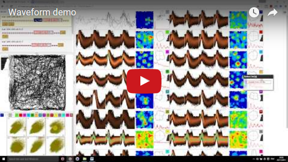

# <a name="wiki"/> Waveform

The application is available live at [d1manson.github.io/waveform](http://d1manson.github.io/waveform).   

For a quick, but fairly complete introduction to the application, please see the following demo:

[](http://www.youtube.com/watch?v=36o69CPu-1E)   

Note that although the demo was recorded before the latest major re-write, there should be only minor differences from the point of view of the end-user.

## Additional notes for end-users

As with any other web application, you will always get the latest verison of the application when you navigate to it in your browser, although you may need to clear you cache using `Cltr-Shift-F5` (I think?).  Every now and again, updates will be tagged as a "release", which doesn't mean anything particularly special, but you can get notifications of these releases by subscribing to the [RSS feed](https://github.com/d1manson/waveform/releases.atom) (I recommend [blogtrottr](https://blogtrottr.com/) for getting RSS updates by email).   

If you are looking for the script that lets you run [KlustaKwik](https://github.com/klusta-team/klustakwik) in batches from the right-click menu in Windows Explorer (yes, Windows only), it's [here](https://googledrive.com/host/0B2QfZjKOj5KxT2wwSFZwRUVXNVE/fancykk.zip).   

If you find bugs please, please, please, report them - either using the github issue interface or via email.  And if you have a feature request, don't hold back from suggesting it.  General feedback and thank-yous are also welcome (email is probably most appropriate in this case).

If you haven't done already, I recommend looking at the shorcuts info pane - you can open it using the button in the toolbar (second from the left) or using the shortcut `k`.

Should you wish to (and right now it's not obvious that you would) you can interact with the application from the F12 developer console, using the variable named `wav`.  The developer tools in modern browsers are incredibly powerful, even the console itself has a [variety of features](https://developer.chrome.com/devtools/docs/console) in chrome.

---

## Notes for developers

If you are coming from a Matlab-only backgound you might find developing the application a bit tough, but it's worth giving it a shot!  There should hopefully be enough information below to get you started.

#### Build/installation process

You need to download and install [node.js](https://nodejs.org/en/).  You can then install `bower` from the command line:

```
npm install -g bower
```

And then, once you've downloaded/forked this repository, `cd` into the directory and run the following command to download all the dependencies (various things from [Polymer](https://www.polymer-project.org)):

```
bower install
```

At this point you are going to need a way to run a localhost server.  If you have python installed you can use:   

```
python -m SimpleHTTPServer
```

and then go to `localhost:8000\index_full.html` in Chrome.  If you don't have python (and don't feel like installing it specially) then you can (I believe) do something similar using node - [see here](http://stackoverflow.com/a/8427954/2399799).

During developement I suggest using the `index_full.html` url, but when you're ready you can use the following command to build everything, which in this case basically just means concatenating files together in a specialised way:

```
vulcanize index_full.html -o index.html --inline-scripts --strip-comments
```

You can then just go to `localhost:8000` (i.e. without the `index_full.html`.

#### Application Structure

The application is not simple, but it is fairly modular, with the modules existing in a largely flat hierachy (i.e. there aren't many levels of nested complexity).  If you are serious abount wanting to make changes you will need to make some effort to understand how everything fits together.  The following diagram is lacking in a numer of ways but it should provide a sufficently meaningful picture of how things work.  Don't expect to understand everything at once, but come back to it when you are lost or confused.

 

See further down the page for a detailed description of what is going on here and for a key to some of the terms.   

**Notable shortcomings of the diagram:**   

 - ommited features: cluster plots, the path and spike plots, header and undo viewer
 - incorrect names:  e.g. `amps` should actually be `amplitudes`
 - simplifications: e.g. `gl_data` is not actually an `akey`, it is a wrapper around an `akey`, with a few other pieces of data from the header provided for convenice.
 - inconsistencies: the distinction between blue and black text is a bit arbitrary; `akey` and `ckey` are sometimes used to refer to a raw `canvas`/`buffer+dims` or `TypedArray` respectively; the `buffer` cache is shown for the `tet-parser` and `pos-parser` threads but not for the `set` or `cut` threads. 

#### A proper introduction

The application is written using the [Polymer framework](https://www.polymer-project.org) (although you're not supposed to refer to it as a "framework").  At the time of writing, Polymer is at version 1.4, which is supposed to be "production ready", but in reality there's still more polishing to be done in terms of making things easy for the developer and giving helpful warnings/errors when you don't do them right.  However it is already a super tool for building interactive interfaces.    

The nice thing about Polymer is that it generally offers clean [declarative](https://en.wikipedia.org/wiki/Declarative_programming) ways of expressing things, where in this case "declarative" means written in HTML without javascript, or with only minimal javascript.  The cleanliness is achived by encapsulating "things" as custom elements, and then hooking up the the dynamic properties of the elements using the Polymer binding syntax.

If you have a quick look at `index_full.html` and then glance back at the main diagram, you will see that each of the modules in the diagram is an html element, with their properties bound together using Polymer's special syntax.  Below we give a highly distilled version of that page, which retains only the general concept of binding between elements:

```html
<head>
	...
	<link rel="import" href="undo-stack-view.html">
	<link rel="import" href="cut-object.html">
	...
</head>
<body>
	<template is="dom-bind" id="the_app">
		...
		<undo-stack-view 
		    undo_stack="[[cut_undo_stack]]"
		    redo_stack="[[cut_redo_stack]]"></undo-stack-view>
		...
		<cut-object 
			groups="{{cut_groups}}"
			cut_box="[[cut_box]]"
			undo_stack_descriptions="{{cut_undo_stack}}"
			redo_stack_descriptions="{{cut_redo_stack}}"></cut-object>
		...
	</template>
</body>
```

In the `head` we import the definitions of two custom elements, `undo-stack-view` and `cut-object`, then somewhere in the page's `body` we use each element once. (Note that in general elements can appear in multiple places on the page, but often we only need to use each once.)  If you've used the application you should recognised the `undo-stack-view` as it has an obvious visual representation on the page. On the other hand, the `cut-object` does not have any visible aspect, as it is just used for encapsulating logic.   

The `some_property="{{some_variable}}"` syntax is the way you tell Polymer to bind things together: `some_property` has been defined inside the custom element, and `some_variable` will be automatically created by the `<template is='dom-bind'>` element that wraps the whole application.  The important thing to recognise is that the `undo-stack-view` and `cut-object` bind using the same variables - `cut_undo_stack` and `cut_redo_stack` - this means that when one element changes the property the other element will automatically update.   

There are various rules about exactly how binding works in Polymer, for example `{{...}}` and `[[...]]` do slightly different things.  At this point it may be worth reading the Polymer docs in a bit of detail, and perhaps looking at some of the more simple uses here: `undo-stack-view`, `document-focus-marker`, `header-view`.

One thing that is important here, and not explained particularlly well in the Polymer docs, is that JavaScript `Object`s are not copied between bindings, if two elements are bound to the same object they both have a reference to the actual same object, i.e. if one element changes something inside the object, that change will affect the other element, even if the change is made without using the Polymeric `set`/`notifyPath` mechanism.  Indeed part of the purpose of `notifyPath` is to bring to the attention of the other element that a change has been made to something within a particular object it has a reference to.  

Note that there may be some cases where read-and-write binding notation, `{{...}}`, is used when read-only notation, `[[...]]`, would have been more correct.  The confusion arose out of the fact that read-only access to an object permits write access to the contents of the object, it just prevents binding the given variable to a different object.

#### A quick primer on threads/async operations etc.

In a simple web application there is one JavaScript thread, which has a queue of tasks that need to be processed.  These tasks are things like mouse-click events, a `setTimeout` timer firing, a file ariving over the network, or the page itself announcing that it is fully loaded.  It is criticial to appreciate that *only one* task is running at any one time: if you have a big loop doing something complicated and the user clicks the mouse or scrolls, these new events will have to wait until you have finished processing the previous task.  This is both a blessing and a curse:   

A "curse" because if you have a pair of buttons that each trigger long-running computations, but such that the computations are entirely independant of one another, you might hope that you could click both buttons in quick succession and expect the computer to run the separate tasks simultaneously...but this does not happen.  Instead, the first task finishes and then the second task begins.  Worse than that, on "the main thread", it's not just JustScript running one task at a time, it has to share time with (some of) the browser's internal machienery that lays out and renders the page.  And then there's the garbage collector, which periodically iterupts everything to move things around in memory so as to free up and defragment the JavaScript heap. An immediate thing to notice about this one-at-a-time queue paradigm, is that if you click a button to start a long-running process - or worse, you click the button several times - and then you press a button to cancel the computation, the cancel request will not be processed till after everything else has already completed (by which point there's nothing left to cancel, obviously, so in the end the button wouldn't have actually served any purpose!).

It is also a "blessing", because it becomes much easier, although not trivial, to reason about what is going on in the program at any given time.  Imagine looping over a complex structure, passing various things to subfunctions and somehow aggregating the results - the work may take several tens of miliseconds, but during the whole process you can be sure that nothing else is secretly modifying the structure because this particular function (and the subfunctions that it explictly calls) is the only thing running.  Note how this works recursively: at every level of the stack each function knows (well, the author of the function knows) that only itself and the subfunctions it calls are modifying things.

The first way of overcoming the limitations of this paradigm, is to avoid doing long-running tasks directly in response to user actions. Instead, you have to place a new task at the end of the task queue (using `setTimeout` or `setImmediate`).  If you are careful, you can use this system to implement a "cancelling" mechanism - this does not mean that we can interput running tasks, only that we are able to prevent future tasks from starting to run.  This leads to the idea that long-running computations should be split up into multiple tasks so that they can be canceled if neccessary.  In some cases (and I'm not sure there are many at all in this project), you will need to use an API (i.e. some feature of the browser or third party libary) that only offers an "asynchrous" implementation, meaning that your request will be fulfilled at some unspecified point in the future and the result placed in the task queue for you to respond to.  If the API feature is not interacting with JavaScript (e.g. it is just downloading data from the internet) then it may happen on another thread, i.e. it won't eat into the time availble for your JavaScript to run, which is nice.

However this is not the only option for overcoming the limitations of the one-at-a-time tasks queue: the browser offers `WebWorker`s, which are additional instances of JavaScript that you can launch (with only minimal overhead), each with their own task queue.   Now although each thread is only executing one task at a time, there can be several threads running simultaneously, so you end up with better utilization of the CPU.  This doesn't break the rule of one-at-a-time execution because the separate threads are totally isolated from one another - they live in separate "worlds", and can only communicate by sending strings back and forth.  These messages go onto the task queue at the destination thread (like everything else).  Although I said "only strings", the system actually supports sending copies of objects, and it also alows you to send large chunks of data by transfering ownership entirely from one thread to another thread. See [here](https://developer.mozilla.org/en-US/docs/Web/API/Web_Workers_API/Using_web_workers) for more details.  Note that in normal native (e.g. C++) computing, "threads" are not isolated from one another only "processes" are, so in a sense WebWorkers are more like processes than threads (it's onoly behind the scenes that they are actually threads who do in fact share the same "world").

The final option of note is the GPU.  The APIs for using the GPU from within the browser are the equivalent of the native APIs from the early 2000s, that is they are rather basic.  Although of course the hardware you are running it on is obviously a lot faster than it was 10 years ago.  WebGL, which is the only way you can talk to the GPU, is a set of mostly asynchrouns APIs. I won't go in to details here, except to say that you write a (short) kernel program in a C-like language, upload some data to the GPU, and then issue instructions to run the program on a certain portion of the data.  The instructions themselves are breif: "please use my program to draw 10k lines based on the 20k items of data I have provided". The instruction is issued from the JavaScript thread, but runs asynchrounsly (and very quickly) on the GPU.  As it happens, the way we use WebGL here, we actually end up stalling the JavaScript thread waiting for it to finish, because we copy the results from one `canvas` (that's not on screen) to the multiple canvases on screen. So in a sense we fail to escape the one-at-a-time pardigm by doing this...well, I suppose the GPU is doing many-at-a-time while we wait, which is why it's worth waiting!

For completeness, I should mention the concept of the "micro-task" queue, which is particularly relevant when using Polymer.  The mirco-task queue is like the main task queue, but the events that it processes are not "proper" events, they are "micro-events" (I don't know what the proper term for them is) that are generated during the current (major-)task.  Exactly which operations create "micro" rather than "major" tasks is not well standardized by browsers (I believe), but in Polymer you can use `debouce` or `async` to create a mirco-task. (As it happens, I think the micro-task queue is actually implemented explicitly by Polymer rather than relying on any browser features.)

In this project we deal with WebWorkers using the custom `build-worker` element.  We also provide `setImmediate` in `utils.html`, which allows for the `timer_tick` mechanism highlighted in the main diagram and introduced above (although we didn't refer to it by name in this section).

#### The gory details of data flows

*Following this section is a glossary/key to some of the terms being used.*   

As shown in the primary diagram, the "beating heart" of the application is composed of the `parsed-data` element and `cut-object` (there is one of each on the page).  The `parsed-data` element is responsible for reading files from disk and producing easy to use arrays of data such as `spike_times`, and `pos_xy`.  The `cut-object` manages the list of groups in the current cut.  

Before we dive into all the details of the data parsing and the cut, note that the `file-organiser` element is the thing visible in the top-left of the page. Its job is to respond to `FileList`s being dragged onto the page by organising, sorting, and displaying them, and alowing the user to jump between them.  It has a `selected_files` property which changes exactly once (or not at all) when the user clicks on something in the `file-organiser`.  The `parsed-data` element can then take full control over how it wishes to transition from the old selection of files to the new selection, i.e. only `null`ing and loading the things which are changing.

**The `parsed-data` element** responds to three things: (1) changes to the `selected_files` object, which specifies a file/null for each of set, pos, tet, and cut; (2) changes of the pos-post-processing options; (3) changes to which parts of the tet data are actually wanted by the aplication (e.g. if the waves are not being rendered then we don't need to obtain the expensive-to-produce `data_for_gl` array).  As mentioned already, note that the `selected_files` object only changes once when the user jumps between trials/tets/cuts. When this happens, the `parsed-data` element draws up a list of things that have changed, and then the first thing it does is set all the relevant outputs to null, e.g. if the tetrode file is changing it will set the `amps`, `spike_times`, etc. to `null`.  This `null`ifying is observed *synchrounsly* by all the various elements that are bound to the given data, i.e. once the `parsed-data` element has finished setting everything to `null` all the interested parties have already got the message and acted apropriately.   

After performing this `null`ing, the `parsed-data` element then looks in its cache to see if it already has the parsed data for any of the new files.  If you are switching back and forth between trials/tetrodes/cut files, it will indeed find some of the data in its cache.  This means it can immedaitely set the relevant values, e.g. if it already has `pos_xy` (and friends) it can immediately set the values for all interested parties to see, and again the interested parties will process this data *synchronosly*.  Any files with data unavaialble, will be put into a request that is sent to the `io-worker` thread.

Originally it was planned for the `io-worker` to do the reading from disk and send the resulting buffers to the various other threads to do their parsing.  However it turned out that Chrome does not currently support transfering buffers between sibling threads, only to/from main thread. The workaround implemented is as follows: the io-worker doesn't do any heavy work, it just acts as a coordinator: it recieves requests from the main thread and then issues one request at a time to a parser thread, waiting for the given parser thread to return an "I'm done with the hard disk" message, before issuing the instruction to the next parser thread.  This alows for the `io-worker` to control the order of who reads from disk; in particular we choose to read the tet file before anything else, because tet files require the most processing (~1-2ms per 1k spikes), and thus reading them first alows for the greatest overlap of IO/compute.

As you can see in the diagram, the tet and pos workers maintain a cache of buffers (the cut and set workers do too, but I forgot about this when making the diagram!), this is in addition to the cache of parsed-data on the main thread.  These buffers are the entire contents of the given file.  In the case of the pos-parser its main function is to allow for a rapid re-running of the post-processing when you change the options. And in the case of the tet-file the buffer allows you to load the file without bothering to get all the data (e.g. if you hide the waves), but then at a later date go back and quickly get the extra data.  (In the case of the tet file, where the gl_data is larger than the original file, it might make sense to have a larger cache on the tet-parser than on the main thread, but this is currently not the case.) In a sense these caches are not particularly helpful as compared to the cache on the main thread. 

This whole mutli-thread multi-cache system is rather complciated it has to be said, but it does allow the user to switch back and forth quickly and to interupt their switching (have a play using the tetrode-switching shorcut: keys `0-9` to see how quickly you can switch back and forth and change your mind before it's finished loading).  The final part of the explanation for this consists of the following two points: (a) all messages in this multi-threaded system go in a single direction `main => io-worker => thing-parser => main`, that is, `main` thread never communicates directly with `thing-parser`, and `thing-parser` never communicates directly with `io-worker` (except when it sends the "I'm done using the hard disk" message, which is a special case because the `io-worker` won't issue any other requests while it is waiting for this message).  And (b) the two kinds of cache are managed by the "upstream" thread, that is the `io-worker` tells the `thing-parser` when to remove a buffer from its cache and when to add a buffer (well, every request to parse a file implicitly means add it to the cache); and the `thing-parser` tells the main thread when to remove some parsed data from its cache (again, all delivered parse-data should be added to the cache). To see why this is helpful imagine the following scenario...

The user switches to file `A` then `B` then `A` again in very quick succession.  When the `io-worker` thread gets each of these requests, it will cancel any previous requets that haven't yet been issued (for the given file type).  Thus, when it gets the second `A` request, it may or may not have already issued such a request, depending on whether the first request was canceled.  (This next bit is less exciting now that IO actually happens on the `thing-parser` thread rather than on the `io-worker` thread, but here's the original logic...) Cruically, because it is managing the `thing-parser`'s cache, it knows whether file `A` is already in the cache and thus doesn't need to be read off disk afresh (note how the present tense "is", does not refer to the present moment, but to a point in the agreed chronology of messages from the `io-worker` to the `thing-parser`, which is why it is critical for messages to only go in one direction).  The `thing-parser`, when it gets the message to parse file `A`, will - in an exactly analogous way - know whether it has already provided the parsed data to the `main` thread and not yet issued a request to clear it from the cache.  To say that all again from the `main` thread's perspective: some time after issuing the `A-B-A`, main thread recives the parsed results of `A` (and obediently stores it in its cache until further notice): was this the result of the first request for `A`, or from the second request for `A`?  Well, it could have been either, but the system ensured that it would only ever recive one such message, and the work on the various threads would only occur once.

Phew!  You probably didn't need to know *all* those details, but now you do!

**The `cut-object` element** maintains an array of groups, with the nth element of the array corresponding to the group shown on screen with number n - absent groups are `null`s in the array.  The objects in the array are generally refered to as `okey`s (the term is not used for anything else).  A critical feature of the `okey`s is that they contain an array of indices, and that the array is immutable for the lifetime of the `okey`. For example, if group 4 is split in two, then the old `okey` is discarded and two new `okey`s are created; also if groups 7 and 10 are swapped, then (the main thing that happens is) the locations of the two `okey`s are swapped in the groups array rather anything being created or discarded.  

The diagram lists most of the properties of an `okey`, we describe the first three here and leave the rest for later discussion.  The `group_num` is equal to the index in the array, i.e. when we swap groups 7 and 10 we have to update this in both `okey`s.  The `akey` property holds the actual inds array (the thing which is considered immutable).  The term `akey` is used in this project to refer to a "boxed" `TypedArray` of the form `{array: an_actual_array}`. Note that the term does *not* refer specifically to cut indices, it refers to any boxed array.   The third proeprty is `_pkey`, which is the identifier used by Polymer's `Collection` class when dealing with the array.  In order to make this value available in the object it was neccessary to monkey-patch Polymer (see `patch-polymer.html`).  Like `okey`, the term `pkey` is restricted to meaning items in the cut groups array.  If we were only working on one thread, we would not (particuarlly) need to worry about this `pkey`, but when dealing with worker threads, we need some way to identify the `okey`s which doesn't depend on their actual address in memory (because the worker and main thread cannot share access to an object, they have separate copies).  As we willl discuss shortly, the `pkey` is the id used internally by `rm-plots`, `tac-plots`, and `cluster-plots` when communicating with their respective workers.

Although there are several elements which modify the contents of `okey`s, only the `cut-object` itself can (or rather, should) mutate the array.  Making changes has to be done carefully, ensuring immuability of index data is respected, `group_num` values are updated, the undo/redo stack (and corrseponding description stacks) are populated with suitable data, and that the correct polymeric `push`/`splice`/`notifySplices` functions are called.  As such, the `cut-object` exposes several methods that encapsulate correctly-implemented array mutations -  "merging", "swapping", "splitting", etc. - and these functions are called from `index_full.html`. Specifically, they are called from within event listeners that are hooked up to the relevant events emitted by the `tile-wall`, `cluster-plots`, and keyboard.  (This arrangement is partially displayed in the main diagram by the "event" icons above the `tile-wall`, and the list of methods given within the `cut-object`, although the role of `index_full.html` is not shown.)   

The undo/redo stacks contain "deltas" which are objects giving the (roughly) minimal amount of information needed to invert the given action (this minimality is not critical, but it is the current implementation). Note that this means that when undoing/redoing an action, the delta actually has to be updated.  For example, when merging two groups, a and b, you need to record a mask saying which of the spikes in the resulting merged group came from group a and which came from group b (the spikes in the merged group are sorted so you cannot simply split at a given point); however if this action is undone, the only information required for the redo stack is the group numbers a and b, since we can redo the merge using just these two numbers.

So far we haven't discussesd how the groups array is constructed in the first place: when a cut file is available, the `parsed-data` element will provide the raw array of group identies from the file, which can simply be converted to an array of indices for each group; when no cut file is available, the `parsed-data` element will instead provide just the number of spikes, and the `cut-object` will create an array with a single group of the relevant size. (If no tetrode data is avaialble then the cut is left as null.) In both cases, if the user takes an action to mutate the cut (i.e. merge, split, etc.) the `cut-object` will emit a `"fork"` event, signifiying that it should now be treated as a new file.  The `detail` of this event contains a reference to the `groups` array, the undo/redo stacks, the undo/redo description stacks, and the cluster-painter state (which groups are src and dest) - unlike most other things in this project, this object is actually encapsulated as a class, `CutStackState`.  The `file-organiser` listens for this `'fork'` event, and stores the `CutStackState` in the `trials` array as though it were just another cut file.  If the user leaves this cut and then returns to it, the old arrays/objects from the `CutStackState` are reinstated in the `cut-object`. This is the third, and final, way of "constructing" the groups array from the `cut_box` provided by `parsed-data` (it's not exactly constructing, because the array already existed).  Note that this arrangement imposes an extra demand on the internal mechanics of the `cut-object` - it must use a fresh set of arrays/objects for each new `cut_box` that it loads, and it must never overwrite an existing array when mutating the groups, in other words you can never write `groups = <something>` (e.g. `groups=[]` or `groups=something.splice(0)`), except when dealing with a new `cut_box`, at which point it *must* do so.  One final thing to note about cut-forking, is that the `parsed-data` element also listens for the event (in addition to the `file-organiser`), by doing so it knows in advance that the `file-organiser` is about to announce a suprious change of cut file and can thus avoid `nulling` and reissuing the `cut_box`.

**The `tac-plots` and `rm-plots`** elements are similar to each other, but with the `rm-plots` being the more complex of the two: it produces three different kinds of plots, uses more of the parsed data types and also has to produce plots in response to changes of `active_group_a`/`active_group_b`.  In addition, it does some (perhaps unnecessarily) "agressive" caching of various parts of its computations (e.g. caching smoothed dwell maps for reuse across all groups).  It may be worth pointing out that originally the intention was to make it possible to control exactly which of `pos_xy`, `pos_dir`, `pos_speed` was produced in the `pos-parser` worker (as is possible with `tet-parser`), but this level of granularity was never actually implemented as the cost of computing `dir` and `speed` from `xy` is in reality pretty minimal.  

Before explaining how these two function work internally, it is helpful to understand their output: they both result in setting specific properties within individual `okeys` - the `tac-plots` element sets the `okey.tac` property, and the `rm-plots` element sets `okey.rm = {spa:, dir:, speed:, spa_max:, dir_max:}`.  Except in the case of `spa_max` and `dir_max`, which are just numbers (or strings actually), all these values are `ckey`s, which is an object type recognised by the `managed-canvas` element.  A `ckey` can be a boxed `canvas` element of the form: `{canvas: canvas_el}`, or it can be a boxed buffer with accompanying dimensions: `{buffer: some_data, dims: [d0, d1]}`.  In the case of `tac-plots` and `rm-plots` all `ckey`s are of the latter kind.  

There are three optimizations that have been made with regard to updating these values in the `okey`s.  Firstly, rather than create new canvases and insert them into the DOM (which is an expensive operation), we reuse the existing canvases within the `managed-canvas` elements, this is made possible by the `{buffer:, dims:}` form of the `ckey`.  Secondly, all the `rm` values are included in a single object, which can then be notified in one go (for each `okey`), this cuts down on the Polymeric notification overhead. And thirdly, and perhaps most significantly, we actually avoid using the proper Polymeric notification system altogether, intsead using a custom `shortcutNotify` function which alows the notification to go straight from the plot-producing element to the target `tile-element` without going up to the top of the app's hierarchy and back down again - for a fairly comprehensive explanation of this see `patch-polyer.html`.

Ok, so now to the internal mechanisms of these two elements.  They both listen for ("observe") two kinds of changes to the `groups` array: the array being spliced, and the array being entierly swapped out for a different array (or `null`).  From these two events they draw up a list of `okeys`/`pkeys` that have been added and removed and provide it to the `_update_okeys` method.  This function then collects together copies of all the new `akey`s (the actual index data) and sends a message to the worker with the list of changes and the new data - both elements have a "private" worker thread.  As already mentioned, the worker cannot share the definition of an `okey` because objects are never shared across threads, so instead the worker/main thread refer to `pkeys`.  One complication of this is that the Polymeric `pkey` is not unique for the life of the applciation, it is only unique for the life of the given `groups` array.  We could have overcome this by implementing an additional id mechanim, or by patching the `Collection` object further, but instead we opted to resolve the ambiguity using a `pkey_generation` counter.  This is a number held (privately) by the element, which it increments each time it recieves notification of a new `groups` array.  Then, each time it notifies its worker of changes to the list of pkeys, it provides the `pkey_generation` number for the `pkeys` being removed and the `pkeys` being added.  In turn, the worker provides the `pkey_generation` value (in addition to `pkey` values) with any results it returns to the main thread.  This ensures that when the main thread recieves results from the worker thread it can check that the result is for the current generation of the `groups` array (the result is discarded if it is out of date).

Finally, we must discuss the issue of changing options, such as the bin size and smoothing.  This is implemented using the following three-part arrangement: (a) The main thread always stores the worker's `ckey` result for a given `pkey`, placing it at `okey._tac_other` (or `okey._rm_spa_other` etc.). In addition, it stores a little object giving the details of the options used to produce the result (i.e. what bin size), this is kept at `okey._tac_other_options` (or similar). (b) Whenever the options are changed or results are recieved from the worker, the main thread checks to see whether it can "upgrade" the `okey._tac_other` `ckey` to being the actual `okey.tac` value (which is the one visible to the user) - see the `_use_other_if_possible` method.  (c) the worker does not keep a copy of the `ckey`s it produces, but it does keep a copy of the small options objects for each `pkey`. This means that when the main thread informs it of changes to the desired options it can look through its list and see which `pkeys` need to be rendered and sent to the main thread (note how this test of equality between the current desired options and the options used most recently for a given `pkey`, is performed identically on both the main thread and worker threads).  If you read (and understood!) the cache-management system in the `parsed-data` element this plot-producing system should seem fairly familiar as it similarly relies on the idea that one thread can have perfect knowledge of the cached data on the other thread - in the `parsed-data` element explicit cache management instructions were sent from the upstream thread to the reciving thread, but in this case the cache size for each `pkey` is exactly one, and thus each new result implicitly kicks out the previous result.

**The `wave-plots` element** is to an extent similar to the `tac-plots` and `rm-plots`, however it doesn't have a worker threaad, so it can use `okey`s rather `pkey`s.  Like the other `-plots` elements, it listens for splices/setting of the `groups` array, with the additional complication that it needs to pay attention to the `group_num` value not just to the raw index data (for use when rending waves in flag moode).  Because everything is happening on a single thread many things are simpler for the `wave-plots`, although it still uses a `setImmediate` timer, so has to deal with asynchronisity.  The mechanics of how rendering is actually performed on the GPU is a bit fiddly; the webgl-related code is contained within a `WavesRenderer` class and is hopefully reasonably easy to follow if you know a bit about WebGL.  You might also want to check the animation in a [blog post](https://d1manson.wordpress.com/2015/11/27/waveform-gui-neuroscience-in-chrome/) I wrote about the application (the post pre-dates the latest major re-write).

Right, well done if you're still following..even if you're still reading at this point you're doing well.  We've already covered the most important and difficult parts of the application, there just remain a few odds and ends to mention.

**The `tile-wall`  element** basically is a Polymer `dom-repeat` view of the main cut `groups` array.  Its main job is simply to pass through the individual `okey`s to `tile-element`s to render.  In turn, the `tile-elements` make heavy use of the `managed-canvas` element which (as already discussed) will render a `ckey` as a visible canvas.  The only thing worth mentioning here is that there is a fairly close cooperation between the `tile-element` and `tile-wall` in terms of issuing the `split`/`merge`/`grab` events and having everything gnerally operate as it should.  Note that when a `tile-element` emits an event it will (by default) "bubble" up through the `tile-wall` and be visible to `index_full.html`.

**The `cluster-plots` element** is a bit like a simple version of `rm-plots`, though like the `tile-wall` it emits events that are listened to by `index_full.html` (the `'paint'` event in this case).

**The `active_group_a` and `active_group_b` values** are `okeys`, and are readable and writeable by the `tile-wall` and `cluster-plots`.  The `rm-plots` element observes changes to these values and produces the path plot with spikes, visisble on the centre-left of the application. Exactly how this is done is not quite as complex as everything else, but it is a bit mixed in with all the other ratemap-generation code so may be a little hard to follow.


#### Glossary

**The `*key` terms**   

The following terms are explained with greater context in the above section, but for convenience, we repeat some of that here. Note that the existence/nature of some of these terms is partially a function of the evolution of the design of the application and may not be perfectly suited for their role. Note also, that it may be possible to encapsulate some/all of these thigns are classes rather than `Object`s, but this was avoided based on the need to support integration with Polymer, which doesn't explicity discuss support for classes (at least I don't think it does).

* `ckey` - this is an object type that can be rendered by the `managed-canvas` element. It is either of the form `{canvas: actual_canavas_element}`, or the form `{buffer: an_array_buffer, dims: [dim_0, dim_1]}`. The first form is used by `wave-plots` and the second form by everything else. Note that in the case of actual `canvas` elements, it  can only be in one place in the dom at any given time. `utils.html` provides a couple of methods for working with `ckey`s.

* `okey` - each object in the main cut `groups` array is called an `okey`. The `okey` contains a set of spike indices for the particular group, and the indices are considered immutable for the lifetime of the `okey`.  A `tile-element` will render all the specific `ckey`s in an `okey` (i.e. the `okey.tac` `ckey` is rendered in the bottom right of the `tile-element`).  The `okey` also contains some data that is "private" to particular elements, e.g. the `tac-plots` element has `okey._tac_other`.  Updates to the non-private `ckeys` are notified directly from the plot-producing element to the relevant `tile-element` using `shortctuNotify`.  `okey`s also contain their `pkey` value....

* `pkey` - `Polymer.Collection` assigns a key to each unique item that it encounters, whether that item is an object or string/number (I actually don't know the full details of this despite having stared at the code for a while).  Here we have monkey-patched `Polymer.Collection` so that objects with a `._pkey` property will have that property set to the collection's key value when added to the collection. We sometimes request and use this key in our own code, particularlly when communicating between worker and main thread.  It always refers to an `okey`, rather than to any other item managed by `Polymer`.  Note that the key is only unique within the a specific array..two different cut arrays will (in general) reuse the same key names for entirely different data.  We thus often qualify the "key" with a "`pkey_generation`" number.

* `akey` - this is simply an object of the form `{array: some_typed_array}`.

* `fkey` - this is an object of the form `{file: actual_file_object, id: positive_number}`, where the `actual_file_object` is from a `FileList` recived during a drag-drop operation.  Analgous to the `okey`-`pkey` relationship, the `id` is used when communicating beween main thread and worker (in `parsed-data`).  Somewhat confusingly, the `id` is itself is usually refered to as an `fkey`...who doesn't love a bit of [synecodoche](https://en.wikipedia.org/wiki/Synecdoche)?!  When a cut is forked, a fake `fkey` is produced which has `id:null`, and is actually an instance of `CutStackState`.  `Utils.file_manager` is responsible for issuing `fkey`s (in so far as it issues uinque `id`s).

**Events**   

Using events as a means of mutating state is un-Polymeric, and we avoid using them as much as possible. However mutations of the cut are all enacted as events being issued from a specific element and the data being caught and dealt with by `index_full.html`.  Grabbing is also dealt with using events:

* `cut-object.fork` - issued when a cut file/null-cut is mutated by the user, so that it now has an actual stack of changes and constitues something that can be saved by dragging back to the desktop.  The main listener of this event is the `file-organiser` as it needs to create a new psuedo-file in its list of files.  But `parsed-data` also listens to the event so that it knows to treat the `file-organiser`'s new object as in fact the same as the original un-forked version.

* `tile-wall.merge_groups` - issued when the user has performed an action requiring two groups to be merged. The actual change is not implemented by the `tile-wall`, rather the event and its detail are passed to the `cut-object` element via a listener in `index.html`.

* `tile-wall.grab_group` - issued when the user has performed an action requring a group's tile to be "grabbed". The actual copying etc. is done by `index.html`.

* `floating-pane.close` - issued when a floating pane is `toggled` into the close state.  This is used by `index.html` to splice out grabbed tiles from `the_app.grabbed_tiles` array when they are closed.

* `managed-canvas.canvas-mouseup` and `-mousedown` and `-mousemove` - has a `canvas_point` property which is a 2-element array giving the position of the cursor in canvas pixels (i.e. not css pixels).

* `tile-wall.splitter` (from self and from child `tile-element`s) - the splittler tool is a bit complicated because its implementation is spread over many files.  There is a `splitter_state` property on `the_app` which is modified in `index.html` in response to the `splitter` events from the `tile-wall`, and this state value is not modified anywhere else, i.e. the `tile-wall` and `tile-element` only read it.  There are several stages to the splitting process: `start`, several `moves` and `update`s, and then `finalize` or `cancel`.  The first three classes are produced by the `tile-element` whereas the latter two are produced by the `tile-wall`, but this distinction is not visible to `index.html`. 

* `cluster-plots.paint` - the event has a `state` value which is either `'start'` or `'end'`. The `'end'` version includes an Object mapping from source `group_num` to a split mask for the group, plus the destination `group_num`.

### Notes on optimizations

At the time of writing Chrome fails to optimize the following:

```javasript
let a = 1;
a += 2
```

Though it does optimize these:
```javascript
var b = 1;
b += 2;
let c = 1;
c++;
let d = 1;
d = d + 2; 
```

Here we opt to use the last form (the one with `d`).

### Notes on naming conventions

The project uses the pythoning naming convention known as [PEP8](https://www.python.org/dev/peps/pep-0008/). This is not common in JavaScript, but it's nice to use because you don't have to think much: just go with `lower_snake_case` for everything except `ClassNames`.  It also has the side effect of making it fairly obvious when you are using an API because the API typically uses `lowerFirstCamelCase`.   

Favour long variable names over abbreviations or ommisions of helpful information, e.g. `pkey_to_rendered_options` is a good variable name because it makes it clear that the object is a form of map (an actual ES6 `Map` in this case rather than an `Object`); it tells you the meaning of the key - `pkey` (which has a special menaing in this project as described elsewhere) - and the full meaning of the value - `rendered_options`.